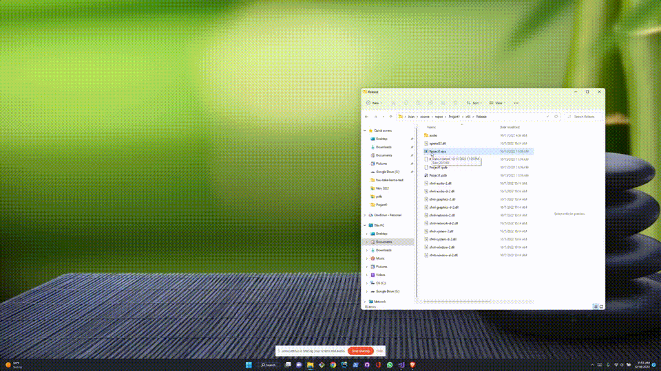

# firstSMLwMusic
A first attempt at using SFML. Displays circles moving across the screen (not music synced). Allows user to: arrow-up/down to increase/decrease volume; arrow-left/right to skip back/forward. Code is in C++.

